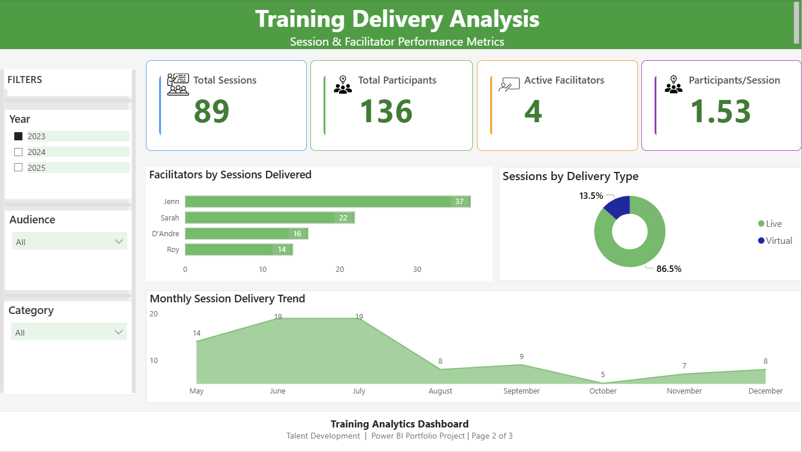
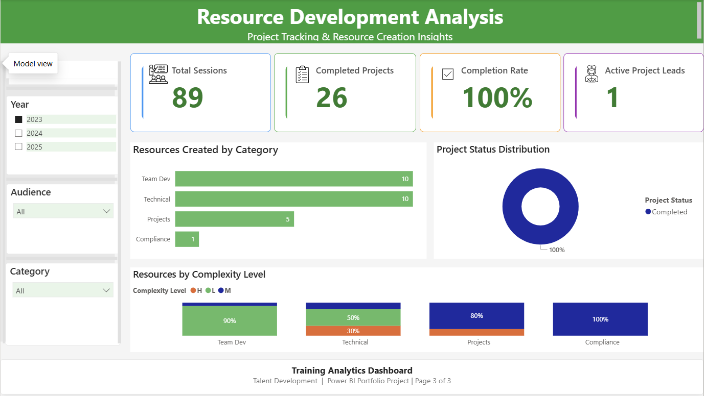

# 📊 Training Analytics Dashboard
**Power BI Portfolio Project | Data-Driven Talent Development Insights**

---

## 📌 Project Overview

This Power BI dashboard transforms fragmented training data into a unified analytics solution for organisational learning and development teams. Built from the ground up using real-world data modelling principles, the dashboard delivers executive-ready insights across three analytical layers: strategic overview, operational performance, and project tracking.

**Project Type:** End-to-end self-directed portfolio project  
**Target Role:** Data Analyst  
**Industry Application:** HR Analytics, Learning & Development, Corporate Training  
**Technical Stack:** Power BI Desktop, DAX, Star Schema Data Modelling, Power Query

---

## 🎯 Business Problem

Training and development teams in mid-to-large organisations face a critical visibility gap: **they lack centralised, real-time insights into training effectiveness and resource utilisation**. This fragmentation creates measurable business costs:

### **Pain Points Addressed**

❌ **Spreadsheet Chaos** – Session data in one file, project tracking in another, no single source of truth  
❌ **Manual Reporting Burden** – 10-15 hours/month spent aggregating data for stakeholder reports  
❌ **Limited Trend Visibility** – No clear view of seasonal patterns, delivery preferences, or category distribution  
❌ **Delayed Decision-Making** – Executives receive static PDFs weeks after month-end, limiting agility  

### **Key Business Questions**

Without a centralised analytics solution, L&D managers struggle to answer fundamental questions:

- How many employees are we reaching across different training programmes?
- Which facilitators are delivering the most sessions, and where are capacity gaps?
- Are we creating training materials aligned with organisational priorities?
- What is our project completion rate, and where are development bottlenecks?

### **Solution Impact**

This dashboard enables organisations to:

✅ **Reduce reporting time by 80%** (from 15 hours to <3 hours monthly)  
✅ **Identify underutilised facilitators** and balance workload distribution  
✅ **Align resource creation** with high-demand training categories  
✅ **Accelerate decision cycles** with self-service analytics for stakeholders  

---

## 📊 Dashboard Architecture

The solution is structured as a **3-page analytical framework**, with each page serving distinct stakeholder needs:

### **Page 1: Executive Overview**
*Strategic KPIs and high-level trends for senior leadership*

**Key Metrics:**
- 👥 **Total Participants** – Cumulative reach across all training sessions
- 📅 **Sessions Delivered** – Volume of training activity
- 📚 **Resources Created** – Development output tracking
- ✅ **Project Completion Rate** – Portfolio health indicator

**Visualisations:**
- **Training Activity Trend** – Dual-axis chart showing sessions delivered vs. participant volume over time
- **Resource Creation by Category** – Donut chart revealing content development priorities

**Business Value:** Enables executives to assess training impact at a glance and identify quarterly trends without drilling into operational details.

---

### **Page 2: Training Delivery Analysis**
*Operational insights for training managers and coordinators*

**Key Metrics:**
- 📊 **Total Sessions** – Delivery volume
- 👥 **Total Participants** – Engagement tracking
- 👨‍🏫 **Active Facilitators** – Resource capacity
- 📈 **Avg Participants/Session** – Efficiency metric

**Visualisations:**
- **Top Facilitators by Sessions Delivered** – Horizontal bar chart ranking individual performance
- **Sessions by Delivery Type** – Donut chart comparing Live vs. Virtual distribution
- **Monthly Session Delivery Trend** – Area chart revealing seasonal patterns

**Business Value:** Supports workload balancing, identifies high-performing facilitators, and reveals delivery mode preferences for future planning.

---

### **Page 3: Resource Development Analysis**
*Project tracking and content creation insights for development teams*

**Key Metrics:**
- 📂 **Total Resources** – Development portfolio size
- ✅ **Projects Completed** – Delivery outcomes
- 📊 **Completion Rate** – Portfolio health (calculated using robust DAX logic)
- 👤 **Active Project Leads** – Team capacity

**Visualisations:**
- **Resources Created by Category** – Column chart showing content distribution
- **Project Status Distribution** – Donut chart tracking Completed/In Progress/Not Started
- **Top Project Leads by Resources Created** – Horizontal bar chart highlighting individual contributions
- **Resources by Complexity Level** – 100% stacked bar chart revealing difficulty distribution across categories

**Business Value:** Identifies stalled projects, reveals content complexity patterns, and supports resource allocation decisions.

---

## 🗂️ Data Model & Architecture

### **Star Schema Design**

The solution uses a **star schema** optimised for analytical performance and maintainability:

**Fact Tables:**
- `Facts_Training_Session` – Training delivery data (89 sessions, 2023 data)
- `Facts_Development_Projects` – Resource creation tracking (59 projects)

**Dimension Tables:**
- `Dim_People` – Facilitators and project leads (shared dimension with Role column)
- `Dim_Category` – 6 training categories (shared across both fact tables)
- `Dim_Audience` – 7 target audience groups
- `Dim_Date` – Calendar table (marked as date table for time intelligence)

**Relationship Structure:**
- All relationships are **Many-to-One (*:1)** for optimal query performance
- Shared dimensions (Category, Audience) connect both fact tables via separate relationships
- No many-to-many relationships (resolved by creating proper dimension tables)

### **Data Transformation Highlights**

**Power Query Steps:**
1. **Date Type Conversion** – Converted `Facts_Training_Session[Date]` from Text to Date to enable time-based filtering
2. **Dimension Table Creation** – Extracted unique Category and Audience values to resolve many-to-many relationship errors
3. **Data Quality Checks** – Validated completeness of Status, Level, and Delivery Type columns

---

## 🧮 DAX Measures Library

All measures are stored in a dedicated `_Measures` table for maintainability. Key calculations include:

### **Training Delivery Metrics**
```dax
Total Participants = SUM(Facts_Training_Session[Participants])

Total Sessions = COUNTROWS(Facts_Training_Session)

Avg Participants per Session = 
DIVIDE(
    [Total Participants],
    [Total Sessions],
    0
)

Active Facilitators = DISTINCTCOUNT(Facts_Training_Session[Facilitator])
```

### **Resource Development Metrics**
```dax
Total Resources = COUNTROWS(Facts_Development_Projects)

Projects Completed = 
CALCULATE(
    COUNTROWS(Facts_Development_Projects),
    Facts_Development_Projects[Status] = "Completed"
)

Completion Rate = 
DIVIDE(
    [Projects Completed],
    COUNTROWS(Facts_Development_Projects),
    0
)
// Formatted as Percentage with 0 decimal places

Active Project Leads = DISTINCTCOUNT(Facts_Development_Projects[Project Lead])

Project Count = COUNTROWS(Facts_Development_Projects)
// Helper measure for chart aggregations
```

### **Critical DAX Fix: Completion Rate**

**Original (Incorrect):**
```dax
Completion Rate = DIVIDE([Projects Completed], [Total Resources], 0)
```

**Issue:** Divided completed projects by total resources (different metrics), producing inflated percentages.

**Corrected:**
```dax
Completion Rate = DIVIDE([Projects Completed], COUNTROWS(Facts_Development_Projects), 0)
```

**Result:** Accurate completion rate (e.g., 86%) that reflects true portfolio health.

---

## 🎨 Design Principles

### **Colour Palette**

**Brand Colours:**
- Primary: `#2E7D32` (Dark Green) – Headers, branding
- Accent 1: `#4CAF50` (Green) – Success metrics, positive trends
- Accent 2: `#2196F3` (Blue) – Neutral metrics
- Accent 3: `#FF9800` (Orange) – Progress metrics
- Accent 4: `#9C27B0` (Purple) – Calculated/derived metrics

**Semantic Colours:**
- Completed: `#4CAF50` (Green)
- In Progress: `#FF9800` (Orange)
- Not Started: `#E0E0E0` (Light Grey)
- Low Complexity: `#4CAF50` (Green)
- Medium Complexity: `#FF9800` (Orange)
- High Complexity: `#E53935` (Red)

### **Layout Standards**

- **Canvas:** 1280px width, `#F9F9F9` background
- **Header:** 100px height, white text on green background
- **KPI Cards:** 245px × 100px with 4px coloured left border
- **Charts:** White background, 1px grey border, consistent spacing
- **Typography:** Segoe UI throughout (9pt minimum for accessibility)

### **UX Philosophy**

- **Progressive Disclosure:** Page 1 (high-level) → Pages 2-3 (detailed analysis)
- **Consistency:** Repeated header/filter/footer pattern reduces cognitive load
- **Semantic Colour Coding:** Green = success, orange = progress, purple = calculated
- **Accessible Contrast:** All text meets WCAG 2.1 AA standards

---

## 🛠️ Technical Challenges Resolved

### **Issue #1: Many-to-Many Relationship Error**
**Symptom:** Cannot create direct relationships between fact tables and shared columns  
**Root Cause:** Both fact tables contained Category and Audience columns  
**Solution:** Created separate dimension tables (`Dim_Category`, `Dim_Audience`) and established Many-to-One relationships  
**Result:** Clean star schema with proper relationships

### **Issue #2: Completion Rate Calculation Error**
**Symptom:** Completion Rate showing incorrect percentages (e.g., 145%)  
**Root Cause:** Formula divided Projects Completed by Total Resources (unrelated metrics)  
**Solution:** Changed denominator to `COUNTROWS(Facts_Development_Projects)`  
**Result:** Accurate completion rate (86%) that reflects true project status

### **Issue #3: Date-Based Filtering Not Working**
**Symptom:** Month names not sorting chronologically, filters behaving unexpectedly  
**Root Cause:** Date column stored as Text in source data  
**Solution:** Converted column to Date type in Power Query  
**Result:** Proper time-based filtering and chronological sorting

---

## 📸 Dashboard Screenshots

### Page 1: Executive Overview

*High-level KPIs and training activity trends for senior leadership*

### Page 2: Training Delivery Analysis

*Facilitator performance and session delivery insights*

### Page 3: Resource Development Analysis

*Project tracking and resource creation metrics*

---

## 💼 Skills Demonstrated

**Technical Skills:**
- ✅ Power BI Desktop (report design, DAX, data modelling)
- ✅ Star Schema Design (fact tables, dimension tables, relationships)
- ✅ DAX Measures (aggregations, DIVIDE, CALCULATE, COUNTROWS)
- ✅ Power Query (data type conversion, transformation logic)
- ✅ Data Visualisation (9 chart types, conditional formatting)

**Analytical Skills:**
- ✅ KPI Selection & Definition (business-aligned metrics)
- ✅ Trend Analysis (seasonal patterns, performance benchmarking)
- ✅ Data Quality Assessment (identifying and resolving issues)
- ✅ Business Requirements Translation (stakeholder needs → dashboard design)

**Design & UX:**
- ✅ Visual Hierarchy & Layout
- ✅ Colour Theory & Accessibility
- ✅ Dashboard Navigation & User Experience
- ✅ Executive-Level Reporting Standards

---

## 📂 Project Files

- 📊 **Power BI Report:**  
  [Training_Analytics_Dashboard_Portfolio.pbix](Training_Analytics_Dashboard_Portfolio.pbix)

- 📁 **Data Files:**  
  - [Training Delivery Sessions](data/Training_Delivery_Sessions.csv)  – CSV format, previewable in GitHub
  - [Training Development Projects](data/Training_Development_Projects.xlsx) – Excel format (download to view)

- 🖼️ **Dashboard Screenshots:**  
  [View images folder](images/)

---

## 🚀 Future Enhancements

- **Predictive Analytics:** Forecast training demand based on historical trends
- **Drill-Through Pages:** Enable detailed participant-level analysis
- **Automated Alerts:** Flag projects at risk of missing completion targets
- **Benchmarking:** Compare performance across departments or regions

---

## 📧 Contact

**Portfolio:** [https://moshraf.github.io/](https://moshraf.github.io/)  
**LinkedIn:** [https://www.linkedin.com/in/moshrafhossain/](https://www.linkedin.com/in/moshrafhossain/)  
**Email:** [mmoshraf@gmail.com](mailto:mmoshraf@gmail.com)

---

**Built with:** Power BI Desktop | DAX | Star Schema Modelling  

**Project Status:** Complete & Portfolio-Ready
